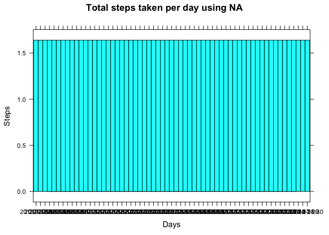

# Reproducible Research: Peer Assessment 1


## Loading and preprocessing the data

```r
# Install library
list_of_packages <- c('lattice', 'xts', 'miscTools')
new_packages <- list_of_packages[!(list_of_packages %in% installed.packages()[,'Package'])]
if(length(new_packages)) install.packages(new_packages, repos="http://cran.rstudio.com/")
library(lattice)
library(xts)
```

```
## Loading required package: zoo
```

```
## 
## Attaching package: 'zoo'
```

```
## The following objects are masked from 'package:base':
## 
##     as.Date, as.Date.numeric
```

```r
library(miscTools)

# Read File
unzip("activity.zip", overwrite = TRUE)
dataset_complete <- read.csv(
    "activity.csv", 
    na.strings = "NA", 
    stringsAsFactors=FALSE, 
    header = TRUE
)

dataset_complete$date <- strptime(dataset_complete$date, "%Y-%m-%d")
dataset_complete$dateFactor <- cut(dataset_complete$date, breaks="days")
```

## What is mean total number of steps taken per day?

```r
# Ignore NA and 0 Steps
dataset <- dataset_complete[!is.na(dataset_complete$steps),]
# dataset <- dataset[!dataset$steps == 0,] --- Removing 0's throw more meaningfull results
# in pretty much every graph. As that wasn't requested I left this commented. 
# Uncomment to see better Histogram, median and mean results.

# Draw Histogram
histogram(
    dataset$steps ~ dataset$dateFactor, 
    xlab='Days', 
    ylab='Steps', 
    main="Total steps taken per day"
)
```

<!-- -->

```r
# Prepare Steps Time Series
steps.xts <- xts(dataset$steps, dataset$date)

# Steps Mean
steps_means <- apply.daily(steps.xts, colMeans)
plot(steps_means, main="Mean of steps per day")
```

<!-- -->

```r
steps_means
```

```
##                  [,1]
## 2012-10-02  0.4375000
## 2012-10-03 39.4166667
## 2012-10-04 42.0694444
## 2012-10-05 46.1597222
## 2012-10-06 53.5416667
## 2012-10-07 38.2465278
## 2012-10-09 44.4826389
## 2012-10-10 34.3750000
## 2012-10-11 35.7777778
## 2012-10-12 60.3541667
## 2012-10-13 43.1458333
## 2012-10-14 52.4236111
## 2012-10-15 35.2048611
## 2012-10-16 52.3750000
## 2012-10-17 46.7083333
## 2012-10-18 34.9166667
## 2012-10-19 41.0729167
## 2012-10-20 36.0937500
## 2012-10-21 30.6284722
## 2012-10-22 46.7361111
## 2012-10-23 30.9652778
## 2012-10-24 29.0104167
## 2012-10-25  8.6527778
## 2012-10-26 23.5347222
## 2012-10-27 35.1354167
## 2012-10-28 39.7847222
## 2012-10-29 17.4236111
## 2012-10-30 34.0937500
## 2012-10-31 53.5208333
## 2012-11-02 36.8055556
## 2012-11-03 36.7048611
## 2012-11-05 36.2465278
## 2012-11-06 28.9375000
## 2012-11-07 44.7326389
## 2012-11-08 11.1770833
## 2012-11-11 43.7777778
## 2012-11-12 37.3784722
## 2012-11-13 25.4722222
## 2012-11-15  0.1423611
## 2012-11-16 18.8923611
## 2012-11-17 49.7881944
## 2012-11-18 52.4652778
## 2012-11-19 30.6979167
## 2012-11-20 15.5277778
## 2012-11-21 44.3993056
## 2012-11-22 70.9270833
## 2012-11-23 73.5902778
## 2012-11-24 50.2708333
## 2012-11-25 41.0902778
## 2012-11-26 38.7569444
## 2012-11-27 47.3819444
## 2012-11-28 35.3576389
## 2012-11-29 24.4687500
```

```r
# Steps Median
steps_medians <- apply.daily(steps.xts, colMedians)
plot(steps_medians, main="Median of steps per day")
```

<!-- -->

```r
steps_medians
```

```
##            [,1]
## 2012-10-02    0
## 2012-10-03    0
## 2012-10-04    0
## 2012-10-05    0
## 2012-10-06    0
## 2012-10-07    0
## 2012-10-09    0
## 2012-10-10    0
## 2012-10-11    0
## 2012-10-12    0
## 2012-10-13    0
## 2012-10-14    0
## 2012-10-15    0
## 2012-10-16    0
## 2012-10-17    0
## 2012-10-18    0
## 2012-10-19    0
## 2012-10-20    0
## 2012-10-21    0
## 2012-10-22    0
## 2012-10-23    0
## 2012-10-24    0
## 2012-10-25    0
## 2012-10-26    0
## 2012-10-27    0
## 2012-10-28    0
## 2012-10-29    0
## 2012-10-30    0
## 2012-10-31    0
## 2012-11-02    0
## 2012-11-03    0
## 2012-11-05    0
## 2012-11-06    0
## 2012-11-07    0
## 2012-11-08    0
## 2012-11-11    0
## 2012-11-12    0
## 2012-11-13    0
## 2012-11-15    0
## 2012-11-16    0
## 2012-11-17    0
## 2012-11-18    0
## 2012-11-19    0
## 2012-11-20    0
## 2012-11-21    0
## 2012-11-22    0
## 2012-11-23    0
## 2012-11-24    0
## 2012-11-25    0
## 2012-11-26    0
## 2012-11-27    0
## 2012-11-28    0
## 2012-11-29    0
```

## What is the average daily activity pattern?


```r
mean_steps_across_intervals <- aggregate(
    dataset$steps ~ dataset$interval, 
    dataset, 
    mean
)

names(mean_steps_across_intervals) <- c("interval","steps")

plot(
    mean_steps_across_intervals$interval, 
    mean_steps_across_intervals$steps,
    type="l",
    main="Average number of steps taken by daily interval",
    xlab='Interval',
    ylab='Avg Steps'
)
```

<!-- -->

```r
max_steps_by_interval <- mean_steps_across_intervals[
    mean_steps_across_intervals$steps == max(mean_steps_across_intervals$steps)
    ,]

out <- paste(
    "Interval ", max_steps_by_interval$interval,
    " contains the maximum average"," of steps accros all the days. ",
    sep=""
)

print(out)
```

```
## [1] "Interval 835 contains the maximum average of steps accros all the days. "
```

## Imputing missing values

```r
# Calculate missing Values
dataset_na <- dataset_complete[is.na(dataset_complete$steps),]
out <- paste("There are ", nrow(dataset_na), 
             " rows with no data in the dataset", 
             sep=""
)
print(out)
```

```
## [1] "There are 2304 rows with no data in the dataset"
```

```r
# Fill missing values with Mean of steps by interval
dataset_complete_to_fill <- dataset_complete

#dataset_complete_to_fill$steps[dataset_complete_to_fill$steps == 0] <- NA

for(i in 1:nrow(dataset_complete_to_fill))
{
    if(is.na(dataset_complete_to_fill[i,]$steps) || dataset_complete_to_fill[i,]$steps == 0) {
        steps <- mean_steps_across_intervals[
            mean_steps_across_intervals$interval == dataset_complete_to_fill[i,]$interval,
        ]$steps
        if(length(steps) > 0){
            dataset_complete_to_fill[i,]$steps <- steps            
        }
    }
}

histogram(
    dataset_complete_to_fill$steps ~ dataset_complete_to_fill$dateFactor, 
    xlab='Days', 
    ylab='Steps', 
    main="Total steps taken per day using NA"
)
```

<!-- -->

## Are there differences in activity patterns between weekdays and weekends?

```r
# Create a vector of weekdays
weekdays_list <- c('Monday', 'Tuesday', 'Wednesday', 'Thursday', 'Friday')

# Fill weekday or weekend day
dataset_complete_to_fill$weekDay <- factor((weekdays(dataset_complete_to_fill$date) %in% weekdays_list), 
         levels=c(FALSE, TRUE), labels=c('weekend', 'weekday'))

dataset_weekday <- dataset_complete_to_fill[dataset_complete_to_fill$weekDay == 'weekday',]
dataset_weekday_mean <- aggregate(
    dataset_weekday$steps ~ dataset_weekday$interval, 
    dataset_weekday, 
    mean
)
names(dataset_weekday_mean) <- c("interval","steps")

dataset_weekend <- dataset_complete_to_fill[dataset_complete_to_fill$weekDay == 'weekend',]
dataset_weekend_mean <- aggregate(
    dataset_weekend$steps ~ dataset_weekend$interval, 
    dataset_weekend, 
    mean
)
names(dataset_weekend_mean) <- c("interval","steps")

old.par <- par(mfrow=c(2, 1))
plot(
    dataset_weekday_mean$interval, 
    dataset_weekday_mean$steps,
    type="l",
    main="Weekday",
    xlab='Interval',
    ylab='Avg Steps'
)

plot(
    dataset_weekend_mean$interval, 
    dataset_weekend_mean$steps,
    type="l",
    main="Weekend",
    xlab='Interval',
    ylab='Avg Steps'
)
```

<!-- -->

```r
par(old.par)
```

